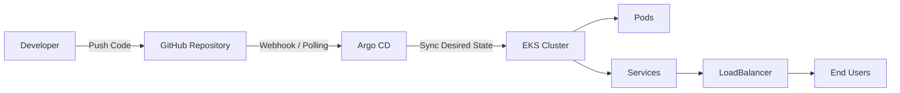

## Architecture Overview

GitHub contains Kubernetes manifests such as Deployment and Service YAML files. Argo CD continuously monitors the Git repository and syncs any changes to the Kubernetes cluster. When the Deployment manifest is updated (for example, with a new image version), Kubernetes performs a rolling update and creates new pods. The Service of type LoadBalancer exposes the application externally by routing traffic to the running pods.


# 🚀 Argo CD GitOps Deployment on Amazon EKS


---

## 📌 Overview

This project demonstrates a **production-grade GitOps workflow** using Argo CD on Amazon EKS.

It enables **automated, declarative, and version-controlled deployments** by synchronizing Kubernetes manifests from GitHub to the cluster.

---

## 🏗️ Architecture Diagram



---

## 🔄 Architecture Flow

1. Developer pushes code (YAML manifests) to GitHub
2. Argo CD monitors repository (GitOps principle)
3. Detects changes automatically
4. Syncs desired state to EKS cluster
5. Kubernetes creates/updates resources
6. LoadBalancer exposes application
7. Users access application

---

## 🧰 Tech Stack

* Kubernetes
* Amazon EKS
* Argo CD
* GitHub
* kubectl
* AWS CLI

---

## ⚙️ Prerequisites

* AWS Account with EKS cluster
* kubectl configured
* AWS CLI configured
* GitHub repo with manifests

---

## 🚀 Setup Guide

### 1️⃣ Create Namespace

```bash
kubectl create namespace argocd
```

---

### 2️⃣ Install Argo CD

```bash
kubectl apply -n argocd -f https://raw.githubusercontent.com/argoproj/argo-cd/stable/manifests/install.yaml
```

---

### 3️⃣ Verify Installation

```bash
kubectl get pods -n argocd
```

---

### 4️⃣ Expose Argo CD UI

```bash
kubectl patch svc argocd-server -n argocd -p '{"spec": {"type": "LoadBalancer"}}'
```

```bash
kubectl get svc argocd-server -n argocd
```

---

### 5️⃣ Login to Argo CD

Get password:

```bash
kubectl -n argocd get secret argocd-initial-admin-secret -o jsonpath="{.data.password}" | base64 -d
```

Access UI:

```
http://<EXTERNAL-IP>
```

Username: `admin`

---

## 📦 Deploy Application

### Create App in Argo CD

* App Name: `my-app`
* Project: `default`

**Source:**

* Repo URL: your GitHub repo
* Path: `/manifests`
* Revision: `HEAD`

**Destination:**

* Cluster: `https://kubernetes.default.svc`
* Namespace: `default`

---

## 📁 Project Structure

```
.
├── deployment.yaml
├── service.yaml
└── README.md
```

---

## ✨ Key Features

* GitOps-based deployment
* Declarative infrastructure
* Auto-sync & self-healing
* Rollback using Git history
* Multi-cluster support

---

## 📊 Benefits

* 🚀 Zero manual deployments
* 🔍 Full visibility of state
* 🔄 Easy rollback
* ⚡ Faster releases
* 📦 Scalable architecture

---

## 🔮 Future Enhancements

* Enable Auto Sync
* Add Helm / Kustomize
* GitHub Actions CI pipeline
* Multi-env setup (Dev / Stage / Prod)
* Monitoring (Prometheus + Grafana)

---

## 🏁 Conclusion

This project demonstrates a **real-world DevOps GitOps pipeline** using Argo CD and Amazon EKS, enabling **automated, reliable, and scalable Kubernetes deployments**.
